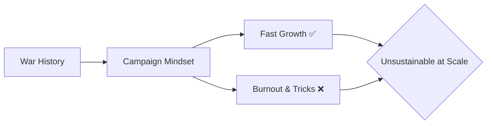
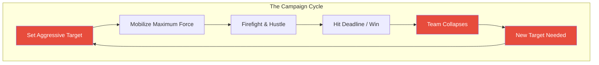
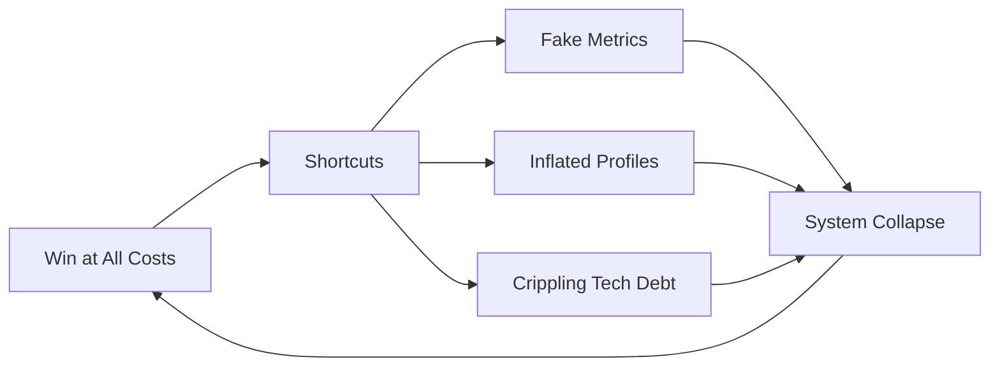
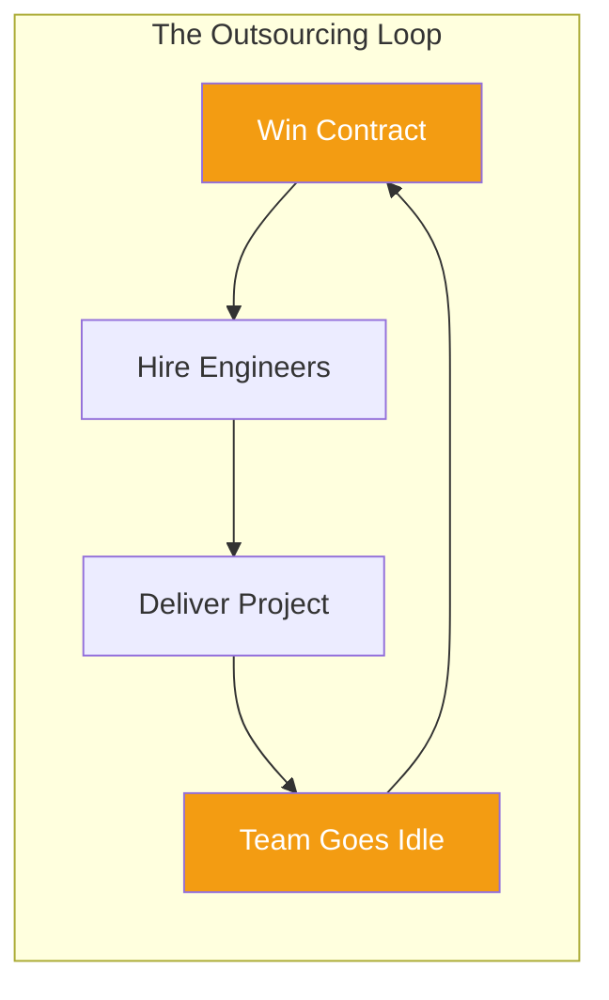
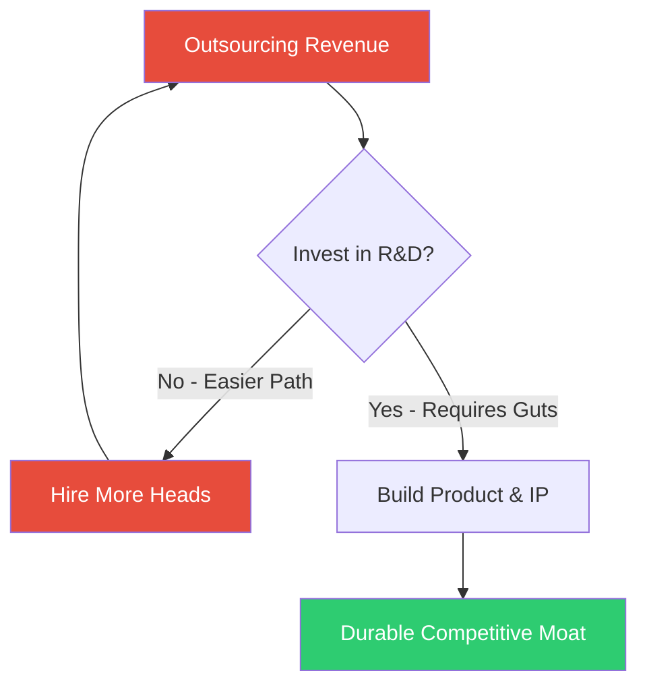
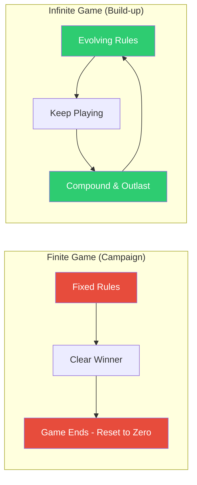
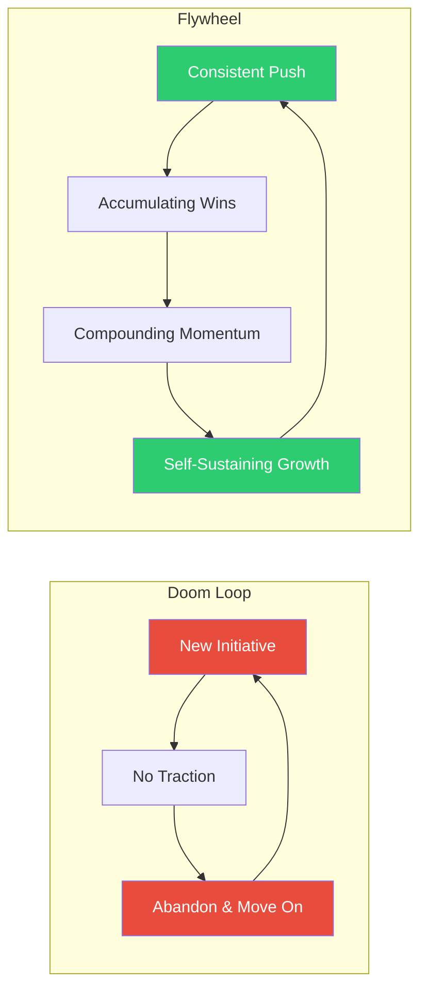
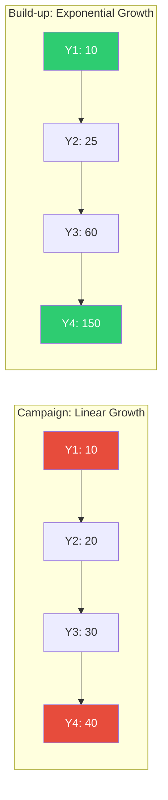
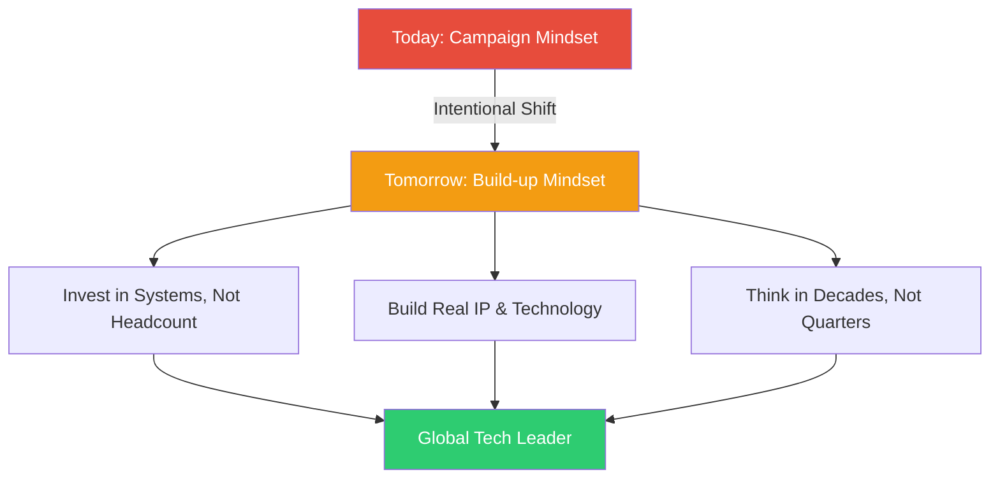

# Campaign vs. Build-up: The Mindset Shift Vietnam Needs

## Introduction: The Peacetime "War"

Vietnam has been at peace for nearly 50 years. Yet walk into any tech company boardroom, and you'd think we're still fighting a war.

Leaders launch "campaigns." Teams are told to "take the hill." FPT's chairman Truong Gia Binh famously called for a "new Dien Bien Phu" in the global tech race. The metaphors are military because the mindset is military.

This campaign-driven approach has delivered results. Vietnam's tech sector has grown rapidly, fueled by cheap labor, fierce hustle, and an appetite for short-term wins. But there's a ceiling. A campaign can win a battle—it cannot build a lasting empire.

The question is: **can we shift from fighting campaigns to building systems?**



---

## The Anatomy of a Campaign

A campaign is a **finite game**. It has clear rules, a fixed timeline, and a winner-takes-all outcome. It runs on adrenaline.



The pattern is seductive. You feel productive. You see results. Everyone high-fives. But look closely: **every campaign resets to zero**. The team burns out, the knowledge scatters, and the next campaign starts from scratch.

### The Dark Side: Gaming the System

When the only thing that matters is hitting the target, people find creative ways to hit it.

Inflated CVs sent to clients. Cosmetic reports that hide technical debt. Promises made without any plan to deliver. This isn't malice—it's what the incentive system rewards. A campaign mindset judges *output* (did we ship?), not *outcome* (did we build something durable?).



> When the general moves on, the army disbands. There is no institution—only the memory of a battle.

---

## The Outsourcing Trap

Nowhere is the campaign mindset more visible than in Vietnam's outsourcing industry.

Every contract is a campaign: win the deal, ramp up headcount, deliver, hand off, repeat. The formula is simple:

> **Profit = (Billable Rate − Labor Cost) × Hours**



There are exactly two levers in this formula: **lower labor costs** or **increase hours**. Neither builds intellectual property. Neither creates a moat. You're trading time for money, every single time.

### The "Lấy Ngắn Nuôi Dài" Myth

Many Vietnamese companies promise to use outsourcing profits to fund product R&D. In practice, the addiction to easy money is too strong. Why invest in a risky product that takes 5 years to mature when you can sign another outsourcing deal and show growth next quarter?

Shareholders demand quarterly results. Executives become hostages to the stock price. The long-term vision gets kicked down the road, year after year.



The result? Vietnam remains a **cost center** in the global tech map, not a **value creator**. We scale headcount, not capabilities. We grow revenue, not influence.

---

## The Western Frameworks: What Build-up Looks Like

Western management theory has precise names for what we're missing. These frameworks explain why a company like Microsoft or Google can dominate for decades while a Vietnamese outsourcing firm hits a wall at 10,000 employees.

### Finite Game vs. Infinite Game

Philosopher James P. Carse and later Simon Sinek drew a sharp distinction:

| | Finite Game | Infinite Game |
|---|---|---|
| Goal | Win | Keep playing |
| Rules | Fixed | Evolving |
| Players | Known competitors | Anyone who joins |
| End state | Game over | Perpetual |

Campaigns are **finite**. When you win, the game ends. Build-ups are **infinite**—there is no finish line, only the commitment to outlast and outlearn everyone else.



### The Flywheel vs. The Doom Loop

Jim Collins, in *Good to Great*, described two patterns organizations fall into:

- **Doom Loop**: Launch a new initiative → no momentum → abandon it → launch something else. This is the campaign cycle at the organizational level.
- **Flywheel**: Consistent, disciplined effort → small compounding wins → massive momentum that becomes self-sustaining.



The Doom Loop feels exciting—every new initiative brings energy. The Flywheel feels boring—just pushing, consistently, year after year. But the Flywheel wins every time.

### Project vs. Product Mindset

In modern tech management, the distinction is clear:

| | Project Mindset | Product Mindset |
|---|---|---|
| Focus | Output (ship on time) | Outcome (user value over time) |
| Rhythm | Sprint → Handoff → Leave | Iterate → Measure → Improve |
| Success | Budget & deadline met | Retention & engagement grow |
| Failure | Project cancelled | Learning that feeds next cycle |
| Risk | Resets every project | Slow start, requires patience |

The campaign is a **project**. The build-up is a **product**.

---

## The Math of Sustainability

Here's the formula that explains everything:

$$V = P \cdot (1 + r)^n$$

- **V** = Sustainable value
- **P** = Initial resources (money, people, effort)
- **r** = Rate of improvement (learning, systems, culture)
- **n** = Time and consistency

The campaign mindset obsesses over **P**: throw more people, more money, more force at the problem.

The build-up mindset nurtures **r** and **n**: build better systems, learn faster, and stay in the game long enough for compounding to work.

```mermaid
graph TD
    A[V = P x (1 + r)^n] --> B[P = Initial Force]
    A --> C[r = System Improvement Rate]
    A --> D[n = Time & Consistency]
    E[Campaign Mindset] --> F[Fixates on P]
    G[Build-up Mindset] --> H[Nurtures r & n]
    style F fill:#e74c3c,color:#fff
    style H fill:#2ecc71,color:#fff
```

### Linear vs. Exponential

The campaign delivers **linear** growth: Year 1 = 10, Year 2 = 20, Year 3 = 30. Predictable, but capped.

The build-up delivers **exponential** growth: Year 1 = 10, Year 2 = 25, Year 3 = 60, Year 4 = 150. It starts slower, but it compounds.



This is the hardest part of the transition. Leaders who are used to seeing results *this quarter* must learn to trust a curve that looks flat for years before it takes off.

---

## Why Vietnam Defaults to Campaign Mode

Understanding *why* we're this way is important. It's not a character flaw—it's history.

**Thousands of years of war.** For most of Vietnamese history, survival meant winning the next battle. Long-term planning didn't matter if you might be invaded next year. This instinct is cultural, deep, and unconscious.

**70 years of rapid catch-up.** After the war, we had to industrialize in decades what took the West centuries. Campaigns were the only way. You don't build systems when you're sprinting just to catch up.

**Shareholder pressure.** Vietnam's stock market is dominated by retail investors looking for quick returns. CEOs who announce a 5-year R&D plan with no profit get punished. The system incentivizes short-termism.

**Cheap labor arbitrage.** Why invest in automation and IP when human labor is still cheaper? This works—until it doesn't. India, Bangladesh, and other markets are competing on the same axis.

---

## The Path Forward: From Taking the Hill to Building the City

A campaign is how you take a hill. A campaign is *not* how you build a city.

The city requires:
- **Systems** that run without heroics
- **Culture** that outlasts any individual leader
- **IP** that compounds over decades
- **Patience** to play the infinite game



This doesn't mean abandoning the campaign mindset entirely. Campaigns are useful tools—for product launches, market entries, crisis response. The problem is using them as the *only* tool.

The shift is subtle but profound: **run campaigns *within* a build-up strategy, not instead of one.**

The companies that make this transition will be the ones that define Vietnam's next chapter. Not as the world's outsourcing floor, but as a legitimate technology competitor.

The campaign won us independence. The build-up will win us relevance.

---

## Postscript: A Personal Note

I've lived this tension myself. I grew up in Vietnam's tech scene, worked in outsourcing, felt the adrenaline of winning deals and shipping projects. It's intoxicating. And it's a trap.

When I started building my own products, I had to unlearn everything. The instinct to sprint. The urge to optimize for demo day instead of year 5. The belief that hard work alone is enough.

Hard work is the entry fee. Systems are what pays out.

The most successful builders I know share one trait: **they're boring**. They show up every day. They improve their process by 1%. They ignore the noise. They're still here 10 years later.

That's the build-up. It's not glamorous. But it works.
