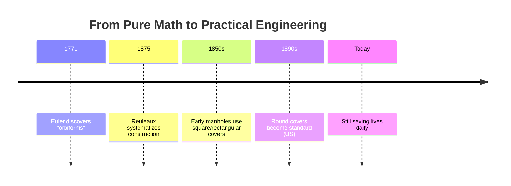

# TIL: Why Manholes Are Round (Curves of Constant Width)

Today I learned something fascinating: manholes aren't round just because circles are convenient — they're round because of a mathematical property called **curves of constant width**. And the best part? A mathematician discovered this property 100 years before anyone needed it.

## The 100-Year Gap: Math Before Manholes

Here's the timeline that blew my mind:

**1771**: Leonhard Euler, studying geometry out of pure curiosity, discovers shapes called "orbiforms" — curves that have the same width no matter how you measure them. He publishes this in his paper _"De curvis triangularibus"_ in 1781.

**1875**: German engineer Franz Reuleaux systematically describes how to construct these curves from polygons. The famous Reuleaux triangle gets named after him.

**1850s-1900s**: Early manholes use **square and rectangular covers** made of cast iron. Engineers soon realize these have problems — they can fall through diagonally, they create stress concentration at corners, and they're hard to position.

**Late 1800s/Early 1900s**: Engineers (probably independently of Euler's math) switch to round covers in the US and many countries. The constant-width property solves all their problems at once.

**That's a 100+ year gap from mathematical discovery to practical application.** Euler had no idea his abstract geometry would one day save lives underground.

## What Are Curves of Constant Width?

A curve of constant width is any shape where the distance between two parallel tangent lines is always the same, no matter what angle you measure from.

The **circle** is the obvious example — its diameter is constant.

But here's the mind-bending part: **the circle isn't the only one!**

The **Reuleaux triangle** is a non-circular curve of constant width. It's made by drawing circular arcs between the vertices of an equilateral triangle:

  <svg width="400" height="300" viewBox="0 0 400 300" xmlns="http://www.w3.org/2000/svg">
    <defs>
      <marker id="arrowhead" markerWidth="10" markerHeight="7" refX="9" refY="3.5" orient="auto">
        <polygon points="0 0, 10 3.5, 0 7" fill="#666" />
      </marker>
    </defs>

    {/* Reuleaux Triangle */}
    <g transform="translate(200, 150)">
      {/* The Reuleaux triangle shape */}
      <path
        d="M 0,-57.735 A 66.667,66.667 0 0,1 57.735,28.868 A 66.667,66.667 0 0,1 -57.735,28.868 A 66.667,66.667 0 0,1 0,-57.735 Z"
        fill="none"
        stroke="#3b82f6"
        strokeWidth="3"
      />

      {/* Measurement lines showing constant width */}
      <line x1="-60" y1="-35" x2="30" y2="60" stroke="#ef4444" strokeWidth="2" strokeDasharray="5,5" markerEnd="url(#arrowhead)" />
      <line x1="60" y1="-35" x2="-30" y2="60" stroke="#ef4444" strokeWidth="2" strokeDasharray="5,5" markerEnd="url(#arrowhead)" />

      {/* Width label */}
      <text x="-80" y="10" fill="#ef4444" fontSize="14" fontWeight="bold">width</text>
      <text x="50" y="10" fill="#ef4444" fontSize="14" fontWeight="bold">width</text>

      {/* Title */}
      <text x="-100" y="-80" fill="#334155" fontSize="16" fontWeight="bold">Reuleaux Triangle</text>
      <text x="-100" y="-60" fill="#64748b" fontSize="13">(Not a circle, but same width everywhere!)</text>
    </g>

  </svg>

## Three Reasons Round Covers Win

### 1. 🚫 Can't Fall Through

This is the critical safety insight.

**Square cover problem**: A square cover's diagonal is longer than its side (thanks, Pythagorean theorem). So if you tilt it just right, it falls through:

$$\text{diagonal} = \text{side} \times \sqrt{2} \approx 1.41 \times \text{side}$$

**Round cover magic**: Because a circle has constant width, its diameter is the same at every angle. **Impossible to fall through**, no matter how you rotate it.

  <svg width="100%" height="400" viewBox="0 0 800 400" xmlns="http://www.w3.org/2000/svg">
    <defs>
      {/* Animation for rotating covers */}
      <animateTransform
        id="rotateCircle"
        attributeName="transform"
        attributeType="XML"
        type="rotate"
        from="0 200 150"
        to="360 200 150"
        dur="4s"
        repeatCount="indefinite"
      />
      <animateTransform
        id="rotateSquare"
        attributeName="transform"
        attributeType="XML"
        type="rotate"
        from="0 600 150"
        to="45 600 150"
        dur="2s"
        repeatCount="indefinite"
      />
    </defs>

    {/* Left side: SAFE - Round cover */}
    <g>
      <text x="50" y="30" fontSize="20" fontWeight="bold" fill="#10b981">✓ ROUND COVER - SAFE</text>

      {/* Manhole opening (circle) */}
      <circle cx="200" cy="150" r="60" fill="#334155" />

      {/* Cover (rotating circle) */}
      <g>
        <circle cx="200" cy="150" r="65" fill="#64748b" stroke="#94a3b8" strokeWidth="3" opacity="0.9">
          <animateTransform
            attributeName="transform"
            attributeType="XML"
            type="rotate"
            from="0 200 150"
            to="360 200 150"
            dur="4s"
            repeatCount="indefinite"
          />
        </circle>
        {/* Mark on cover to show rotation */}
        <line x1="200" y1="150" x2="200" y2="85" stroke="#ef4444" strokeWidth="3">
          <animateTransform
            attributeName="transform"
            attributeType="XML"
            type="rotate"
            from="0 200 150"
            to="360 200 150"
            dur="4s"
            repeatCount="indefinite"
          />
        </line>
      </g>

      {/* Diameter measurement lines */}
      <g>
        <line x1="135" y1="150" x2="265" y2="150" stroke="#3b82f6" strokeWidth="2" strokeDasharray="5,5" opacity="0.7">
          <animate attributeName="opacity" values="0.7;1;0.7" dur="2s" repeatCount="indefinite" />
        </line>
        <text x="160" y="135" fill="#3b82f6" fontSize="12" fontWeight="bold">diameter</text>
      </g>

      <text x="80" y="280" fontSize="16" fill="#10b981" fontWeight="bold">Diameter constant at ANY angle</text>
      <text x="110" y="300" fontSize="14" fill="#64748b">Cannot fall through!</text>
    </g>

    {/* Right side: DANGER - Square cover */}
    <g>
      <text x="450" y="30" fontSize="20" fontWeight="bold" fill="#ef4444">✗ SQUARE COVER - DANGER</text>

      {/* Manhole opening (square) */}
      <rect x="560" y="110" width="80" height="80" fill="#334155" />

      {/* Cover (rotating square) */}
      <g>
        <rect x="555" y="105" width="90" height="90" fill="#64748b" stroke="#94a3b8" strokeWidth="3" opacity="0.9">
          <animateTransform
            attributeName="transform"
            attributeType="XML"
            type="rotate"
            from="0 600 150"
            to="45 600 150"
            dur="2s"
            repeatCount="indefinite"
          />
        </rect>
        {/* Mark to show rotation */}
        <line x1="600" y1="150" x2="600" y2="105" stroke="#ef4444" strokeWidth="3">
          <animateTransform
            attributeName="transform"
            attributeType="XML"
            type="rotate"
            from="0 600 150"
            to="45 600 150"
            dur="2s"
            repeatCount="indefinite"
          />
        </line>
      </g>

      {/* Diagonal measurement (appears when rotated) */}
      <g opacity="0.7">
        <line x1="536" y1="136" x2="664" y2="164" stroke="#f59e0b" strokeWidth="2" strokeDasharray="5,5">
          <animate attributeName="opacity" values="0.3;1;0.3" dur="2s" repeatCount="indefinite" />
        </line>
        <text x="580" y="130" fill="#f59e0b" fontSize="12" fontWeight="bold">diagonal ≈ 1.41x side</text>
      </g>

      <text x="500" y="280" fontSize="16" fill="#ef4444" fontWeight="bold">At 45°, diagonal > opening</text>
      <text x="540" y="300" fontSize="14" fill="#64748b">Falls through! ☠️</text>
    </g>

    {/* Bottom explanation */}
    <text x="250" y="350" fontSize="14" fill="#334155" fontStyle="italic">Watch the covers rotate above their openings</text>

  </svg>

This is the difference between a safe infrastructure and a deadly one. A worker falling through a manhole can die.

### 2. ⚡ Even Force Distribution

Circles have no corners, which means:

- No stress concentration points
- Even pressure distribution around the entire perimeter
- Better load handling from traffic above
- Simpler gasket/seal design (constant pressure everywhere)

Square covers have corner stress points that can crack under load. Round covers spread force evenly.

### 3. 🔄 Easy to Deploy

Manholes covers are heavy — typically **50 to 300 pounds** (23-136 kg).

**With round covers:**

- Roll it on edge to the installation site (like a wheel!)
- Drop it in — no orientation needed, any rotation fits
- No need for heavy equipment to position it precisely

**With square covers:**

- Must carry it flat (much harder)
- Must align corners correctly
- Requires more workers or equipment

## Fun Fact: The UK Still Uses Square Covers!

Interestingly, in the **United Kingdom**, nearly all manhole covers are **square or rectangular**, not circular!

  <svg width="100%" height="350" viewBox="0 0 800 350" xmlns="http://www.w3.org/2000/svg">
    {/* Title */}
    <text x="300" y="30" fontSize="22" fontWeight="bold" fill="#334155">UK vs US Manholes</text>

    {/* UK Side - Square */}
    <g>
      <text x="80" y="70" fontSize="18" fontWeight="bold" fill="#1e40af">🇬🇧 United Kingdom</text>
      <text x="110" y="95" fontSize="14" fill="#64748b">Square/Rectangular</text>

      {/* Square manhole with frame */}
      <rect x="60" y="120" width="120" height="120" fill="#52525b" stroke="#27272a" strokeWidth="3" rx="2" />

      {/* Inner square showing the cover */}
      <rect x="70" y="130" width="100" height="100" fill="#71717a" stroke="#a1a1aa" strokeWidth="2" rx="1" />

      {/* Grid pattern on cover */}
      <line x1="70" y1="155" x2="170" y2="155" stroke="#52525b" strokeWidth="1" />
      <line x1="70" y1="180" x2="170" y2="180" stroke="#52525b" strokeWidth="1" />
      <line x1="70" y1="205" x2="170" y2="205" stroke="#52525b" strokeWidth="1" />
      <line x1="95" y1="130" x2="95" y2="230" stroke="#52525b" strokeWidth="1" />
      <line x1="120" y1="130" x2="120" y2="230" stroke="#52525b" strokeWidth="1" />
      <line x1="145" y1="130" x2="145" y2="230" stroke="#52525b" strokeWidth="1" />

      {/* Anti-fall lip indicator */}
      <rect x="65" y="125" width="110" height="5" fill="#ef4444" opacity="0.7" />
      <text x="50" y="270" fontSize="13" fill="#ef4444" fontWeight="bold">↑ Anti-fall lip/ledge</text>

      <text x="55" y="300" fontSize="14" fill="#334155">✓ Frame prevents falling</text>
      <text x="55" y="320" fontSize="14" fill="#334155">✗ Must align corners</text>
    </g>

    {/* VS separator */}
    <text x="235" y="190" fontSize="24" fontWeight="bold" fill="#94a3b8">VS</text>

    {/* US Side - Round */}
    <g>
      <text x="340" y="70" fontSize="18" fontWeight="bold" fill="#dc2626">🇺🇸 United States</text>
      <text x="405" y="95" fontSize="14" fill="#64748b">Circular</text>

      {/* Round manhole with frame */}
      <circle cx="400" cy="180" r="60" fill="#52525b" stroke="#27272a" strokeWidth="3" />

      {/* Inner circle showing the cover */}
      <circle cx="400" cy="180" r="50" fill="#71717a" stroke="#a1a1aa" strokeWidth="2" />

      {/* Pattern on cover - radial lines */}
      <line x1="400" y1="130" x2="400" y2="230" stroke="#52525b" strokeWidth="1" />
      <line x1="350" y1="180" x2="450" y2="180" stroke="#52525b" strokeWidth="1" />
      <line x1="365" y1="145" x2="435" y2="215" stroke="#52525b" strokeWidth="1" />
      <line x1="365" y1="215" x2="435" y2="145" stroke="#52525b" strokeWidth="1" />

      {/* Constant width indicator */}
      <circle cx="400" cy="180" r="52" fill="none" stroke="#10b981" strokeWidth="2" strokeDasharray="8,4" opacity="0.7" />
      <text x="330" y="270" fontSize="13" fill="#10b981" fontWeight="bold">Constant width = safe</text>

      <text x="315" y="300" fontSize="14" fill="#334155">✓ Cannot fall through</text>
      <text x="315" y="320" fontSize="14" fill="#334155">✓ Any rotation fits</text>
    </g>

    {/* Photos reference */}
    <g>
      <text x="560" y="70" fontSize="16" fontWeight="bold" fill="#334155">Real Examples:</text>

      {/* UK example box */}
      <rect x="550" y="90" width="200" height="60" fill="#f1f5f9" stroke="#cbd5e1" strokeWidth="2" rx="4" />
      <text x="560" y="110" fontSize="12" fill="#475569">London streets:</text>
      <text x="560" y="128" fontSize="11" fill="#64748b">Square cast iron covers</text>
      <text x="560" y="143" fontSize="11" fill="#64748b">with decorative patterns</text>

      {/* US example box */}
      <rect x="550" y="165" width="200" height="60" fill="#f1f5f9" stroke="#cbd5e1" strokeWidth="2" rx="4" />
      <text x="560" y="185" fontSize="12" fill="#475569">New York streets:</text>
      <text x="560" y="203" fontSize="11" fill="#64748b">Round cast iron covers</text>
      <text x="560" y="218" fontSize="11" fill="#64748b">stamped with "NYC DEP"</text>
    </g>

  </svg>

They solve the "falling through" problem with anti-fall mechanisms like lips and ledges around the frame. This shows there are multiple engineering solutions — round just happens to be the simplest and most elegant.

If you're ever in London, look down! You'll see square manhole covers everywhere with intricate Victorian-era patterns cast into them:

  
  

    A typical square manhole cover in London, showing the Victorian-era decorative patterns and the
    diagonal split design that makes them easier to lift.
  

## Other Cool Applications of Constant-Width Curves

Once you know about this property, you see it everywhere:

🪙 **British 20p and 50p coins**: Reuleaux polygons! They have constant width so they work in vending machines but save metal compared to circles.

🔩 **Drill bits for square holes**: A Reuleaux triangle drill bit can cut a nearly-square hole.

🚗 **Wankel rotary engines**: Use Reuleaux triangle rotors.

🎬 **Film projectors**: Early camera mechanisms used Reuleaux triangles.

## Pop Culture: The Famous Microsoft Interview Question

If you've ever interviewed at a tech company, you might recognize this question: **"Why are manhole covers round?"**

  <h3 className="mb-3 text-lg font-bold text-gray-900">💼 The 1990s Tech Interview Era</h3>
  

    Microsoft made this question famous in the 1990s during the dot-com boom. Based on Bill Gates's
    obsession with puzzles, they asked candidates brainteasers to test "thinking on their feet."
  

  

    

      
✓ What they wanted to hear:

      <ul className="list-inside list-disc space-y-1 text-gray-700">
        <li>Can't fall through at any angle</li>
        <li>No orientation needed</li>
        <li>Easy to roll into place</li>
        <li>Multiple valid answers accepted</li>
      </ul>
    

    

      
📊 What happened:

      <ul className="list-inside list-disc space-y-1 text-gray-700">
        <li>Google and others copied the practice</li>
        <li>Became legendary in tech culture</li>
        <li>Research showed it annoyed candidates</li>
        <li>Didn't predict job performance</li>
      </ul>
    

  

**The twist?** By 2012, both Microsoft and Google largely abandoned these puzzle questions. Turns out asking "Why are manhole covers round?" doesn't tell you if someone can write good code or design good systems. It just tells you if they've heard the question before!

But the question lives on in pop culture — it's now more famous than the actual manholes it asks about. Euler's 1771 geometry became 1890s infrastructure became 1990s job interview fodder. What a journey!

## The Beautiful Lesson

This story perfectly illustrates how **pure mathematics often discovers the solutions before we even know the problems**.

Euler wasn't trying to save construction workers' lives. He wasn't designing infrastructure. He was just exploring geometry because it was beautiful and interesting.

And then, 100+ years later, his abstract "orbiforms" became the answer to a very concrete safety problem.

**That's the magic of math.**

Next time you walk over a manhole cover, take a second to appreciate:

- Euler's curiosity in 1771
- Reuleaux's engineering in 1875
- The anonymous engineers who made the switch from square to round
- The workers whose lives have been saved by this simple geometric property

---

## Further Reading

- [Euler's original paper "De curvis triangularibus" (1781)](https://scholarlycommons.pacific.edu/euler-works/464/)
- [Reuleaux Triangle on Wikipedia](https://en.wikipedia.org/wiki/Reuleaux_triangle)
- [Curves of Constant Width (National Curve Bank)](http://nationalcurvebank.org/deposits/reuleaux.html)

---

**What about you?** What everyday objects have you noticed that use clever math? Let me know! 👇
