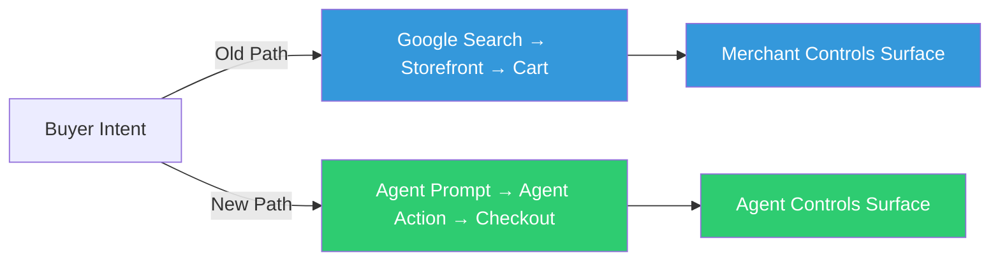
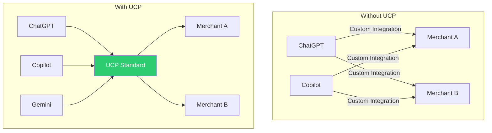
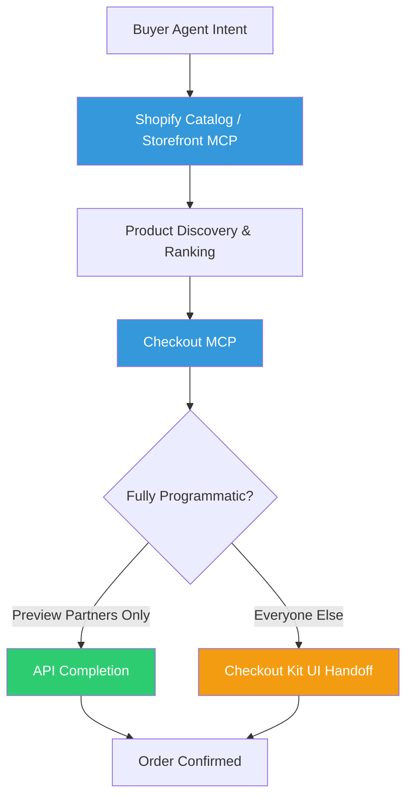
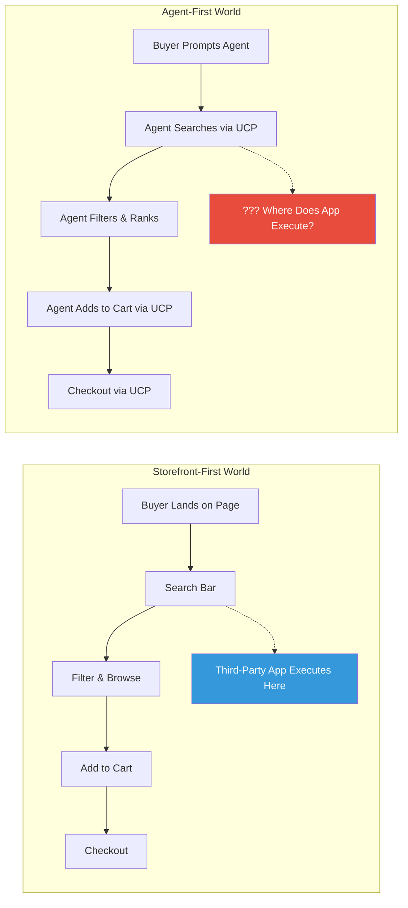
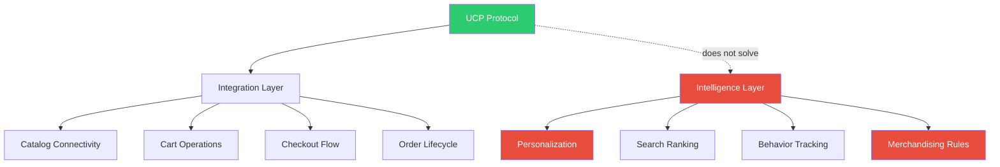
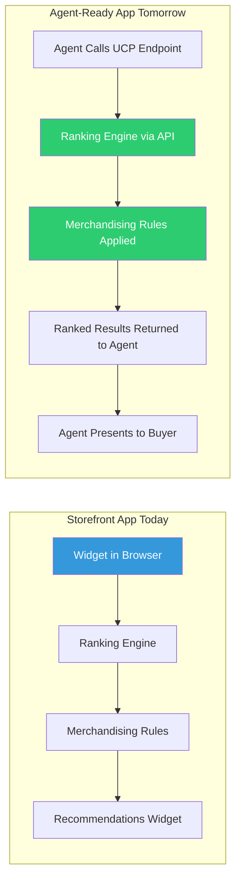
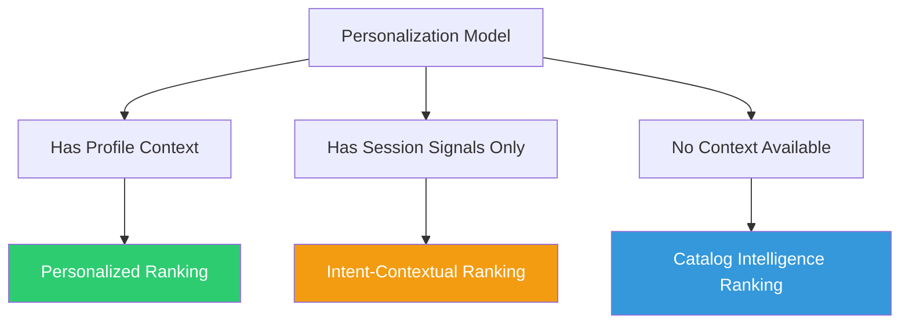
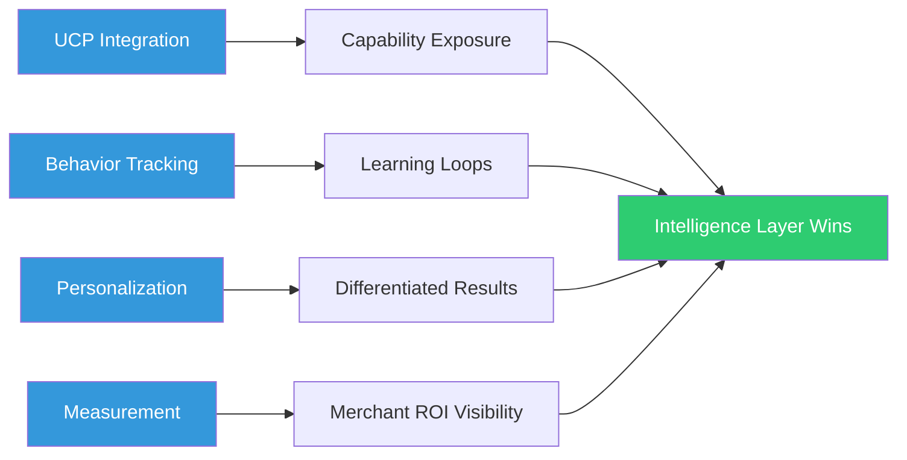
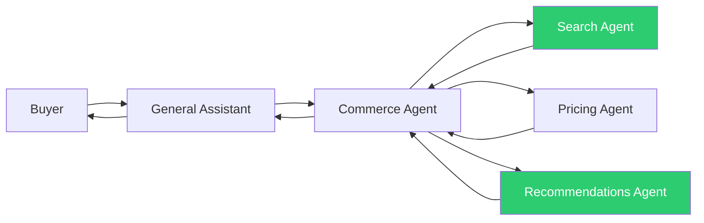

# UCP and Agentic Commerce: What Changes When the Storefront Disappears

## The New Commerce Surface

Something quiet is happening in e-commerce. The storefront — the URL, the page, the product grid, the search bar — is no longer the only place a buyer starts their journey.

Buyers are now asking ChatGPT to find them a running shoe. They're telling Copilot to reorder their usual supplements. They're letting Gemini compare prices and add to cart without ever loading a product page.

This is agentic commerce. And it is not a trend. It is a structural shift in where buyer intent is expressed and fulfilled.

The question for merchants, platforms, and commerce apps is not *whether* this shift happens. It is *how they position* when it does.

---

## What is UCP?

The Universal Commerce Protocol (UCP) is an open integration standard co-developed by Shopify and Google for AI-driven commerce channels. The core idea is simple: instead of every AI agent — ChatGPT, Copilot, Gemini, Claude — building custom integrations with every merchant and platform, UCP defines a common set of machine-readable contracts for the key moments in a commerce transaction.

Those moments are:
- **Catalog discovery**: search, browse, filter, rank
- **Cart operations**: add, remove, update, validate
- **Checkout**: pricing, payment, identity, shipping
- **Order lifecycle**: status, modification, returns

The merchant remains the **Merchant of Record** — the one who owns the transaction, the customer relationship, the refund obligation. UCP does not disintermediate merchants. It gives them a standard language through which agents can interact with their systems.

---

## How Shopify Implements It: The Technical Stack

Shopify's implementation of agentic commerce is not a single API — it's a layered stack of components that each handle a different part of the buyer journey.

### Shopify Catalog

A real-time index of products across Shopify's merchant base, accessible to agents via JSON-RPC. It uses **Universal Product IDs (UPIDs)** to deduplicate results across sellers and surface consolidated pricing. Agents can query this to discover what exists across millions of stores in a single call.

Access is available through two paths: a Catalog MCP requiring OAuth credentials, and a Catalog REST API (`/catalog/search`, `/catalog/lookup`) for programmatic use.

### Storefront MCP

A merchant-specific discovery endpoint at `https://{store_domain}/api/mcp`. Unauthenticated and rate-limited, it exposes `search_shop_catalog` and `search_shop_policies_and_faqs` tools. Suited for single-brand assistants or early prototyping — but it's scoped to one store, not the cross-merchant Catalog.

### Checkout MCP

Programmatic checkout management with a defined state machine. The core tools are `create_checkout`, `update_checkout`, `get_checkout`, `complete_checkout`, and `cancel_checkout`. The checkout progresses through states (`incomplete` → `requires_escalation` → `ready_for_complete` → `completed`), with fallback mechanisms for cases where the agent cannot complete the transaction without user handoff.

### Checkout Kit

An embedded UI component for iOS, Android, React Native, and web. It preserves merchant branding, supports store extensions, and communicates via the Embedded Checkout Protocol (ECP). When full programmatic checkout is not available — which is still the case for most merchants outside the preview program — Checkout Kit is how the transaction closes.

### The Universal Cart

One of the more interesting UCP primitives: a buyer can add items from multiple different Shopify stores into a single logical cart within one conversation. Each merchant remains their own seller-of-record, but the agent orchestrates the checkout sessions and presents them as a unified transaction. This is new territory — no storefront ever offered true cross-merchant cart unification.

---

## What's Still Missing (And Won't Be Ready Soon)

The technical stack above is real, but it's not complete. A few important constraints:

- **Full programmatic checkout** — completing a transaction without any user handoff — is in preview for select partners only. Most agent checkouts still require handing off to a UI component.
- **Order tracking via agents** is still in development.
- **Raw card data via API is prohibited** for security reasons; payment must route through Shopify's secure surfaces.
- **Not all merchants participate** — presence in the agentic catalog is opt-in via the Agentic Storefronts section of Shopify admin.

This matters for competitive analysis. The "agent commerce is here" narrative is partially true and partially aspirational. The foundation exists. The full journey is not yet seamless for most merchants.

---

## Why This Matters for Shopify

For Shopify, UCP is both an opportunity and a structural risk.

The opportunity is clear: Shopify's power has always come from sitting between merchants and buyers. If Shopify can be the infrastructure layer that makes UCP work — the platform through which agent channels access merchant inventory, pricing, and checkout — then its position strengthens rather than weakens as agent commerce grows.

But the risk is equally real. Shopify's third-party app ecosystem is built heavily on **storefront execution**. Search bars. Recommendation widgets. Upsell popups. A/B tested landing pages. These capabilities live in the browser, rendered on the storefront page. If the buyer journey increasingly starts and ends inside an agent interface, the storefront page becomes a confirmation screen, not a discovery surface.

This is not a slow erosion. As agent channels gain share, the execution context for third-party apps shifts from "inside the browser, on the page" to "exposed as a capability via API."

---

## The Pros and Cons of UCP

UCP solves a genuine coordination problem, but it introduces new ones.

**What UCP gets right:**

| Benefit | Why It Matters |
|---|---|
| Standardized integration | One contract works across agents, platforms, merchants |
| Faster adaptability | Channels change without a full rebuild |
| Machine-readable commerce | Agents can reason about products, prices, inventory |
| Merchant stays in control | Transaction ownership stays with the MoR |
| New capability exposure | Apps can expose functionality beyond the storefront |

**What UCP doesn't solve:**

| Limitation | Why It Hurts |
|---|---|
| Agent owns the buyer interface | App cannot own or differentiate the experience |
| UI-based apps lose leverage | Discovery outside the storefront = lost execution context |
| Thin personalization model | Context and signals, but no rich user profile as standard input |
| No built-in behavior tracking | Feedback loops still need to be built independently |
| Search override not guaranteed | Shopify-managed channels may not respect custom ranking even if UCP allows it |

The pattern is important: UCP solves *integration plumbing*. It does not solve *intelligence*. What the agent searches, how it ranks, what it recommends — those decisions are not defined by the protocol. They are defined by whoever provides the intelligence layer.

---

## What This Means for Commerce Apps

Most Shopify apps today are storefront-native. Their value is delivered on the page — search widgets, recommendation carousels, upsell modals, A/B tested layouts. The browser is both the execution environment and the instrumentation layer.

In an agent-first world, that execution model no longer fits. The buyer is in ChatGPT. There is no page, no widget, no click event to observe.

But the *capabilities* these apps provide are not invalidated — they're just in the wrong wrapper. The ability to rank products by intent signals, apply merchandising rules, surface personalized results, and measure what converts: those are exactly the intelligence layers that UCP itself does not provide.

The strategic pivot for commerce app builders is not to abandon what they do well. It is to expose it as **agent-consumable capability** — through stable APIs and capability contracts that agent channels can discover and invoke.

The moat shifts from the widget to what sits behind it: data quality, decisioning logic, tracking, and personalization models.

---

## The Hard Problems UCP Doesn't Solve

Even with UCP in place, two problems remain unsolved for any app that wants to deliver intelligent commerce in an agent context.

### Behavior Tracking

In a storefront world, behavior tracking is instrumented by default. Page views, clicks, searches, scroll depth — the browser captures all of it.

In an agent world, the buyer interaction happens inside ChatGPT or Copilot. There is no browser, no pixel, no click event. You cannot observe what the buyer asked, how the agent ranked results, or what they ultimately chose.

Without solving this, you can expose a search API but cannot improve it. Ranking models go stale. Personalization has no signal to learn from.

The path forward involves rethinking signal capture entirely — relying on order outcomes, post-purchase attribution, and explicit feedback loops rather than implicit browsing behavior.

### Personalization

UCP supports context and signals as inputs. But a rich buyer profile — purchase history, stated preferences, behavioral patterns — is not a guaranteed standard input. Agents may pass some session context, but there is no guarantee of a fully-formed user profile.

This means personalization in agent commerce must degrade gracefully: highly personalized when profile context is available, intent-contextual when only session signals exist, catalog-intelligent when nothing is known.

---

## The Strategic Conclusion

UCP is not valuable because it is the next trend. It is valuable because it is a coordination mechanism that will exist regardless of which agents win market share. Building to it is building to a stable surface.

But the winners in agent commerce will not win because they connected to the protocol first. They will win because they own the intelligence that runs on top of it.

The real competition is not integration speed — it is capability depth. Better search. Better ranking. Better personalization. Better measurement. Those advantages don't come from the protocol. They come from the data and models you bring to it.

---

## What Comes After UCP: Agent-to-Agent Commerce

The next layer beyond UCP is already being prototyped: **Agent-to-Agent (A2A) protocols**, where specialized commerce agents coordinate with each other rather than with a human-facing interface.

In this model, a general-purpose assistant (ChatGPT, Gemini) delegates to a specialized commerce agent, which in turn delegates to a search agent, a pricing agent, a recommendations agent. The buyer never interacts with these sub-agents directly — they operate in the background, coordinated by a higher-level orchestrator.

This defines what "agent-consumable capability" eventually means at its fullest. It is not just "have a REST API." It is having a capability that can be discovered, invoked, and trusted by another agent — with clear inputs, predictable outputs, and a contract that another system can reason about.

The A2A layer is still early. But it is the direction — and building toward agent-consumable commerce capabilities is not just a UCP play, it is positioning for the architecture that follows UCP.

---

## A Note on Timing

None of this is urgent in the sense of "ship it next sprint." Agent commerce is growing but still a small share of total commerce volume. Full programmatic checkout is in preview, not GA. The storefront is not going away this year or next.

But the companies that wait until agent commerce is dominant before adapting will face the same problem that traditional retailers faced with e-commerce: the time to build the capability is before you need it, not after.

The integration model is changing. The execution context is moving. The place to build a moat is shifting from the browser to the API.

Start now, while there is still time to be a first-mover rather than a fast-follower.
